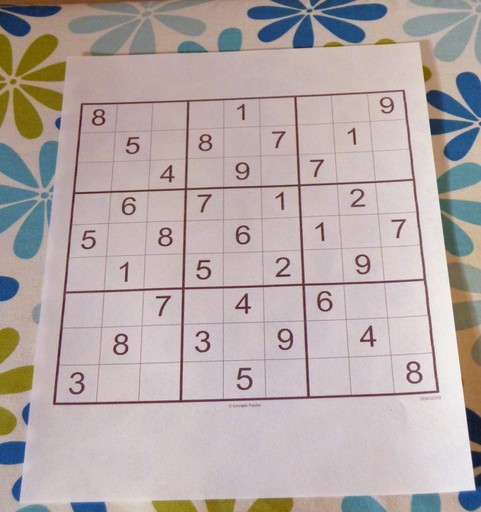
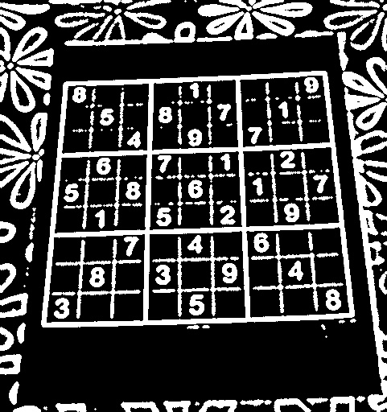
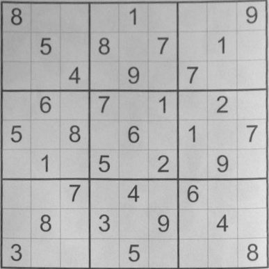
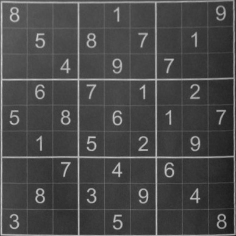
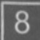

<div align="center">
  <a href="https://github.com/othneildrew/Best-README-Template">
  </a>

  <h3 align="center">SudokuAI</h3>

  <p align="center">
    A Sudoku solver is written in Python with machine learning and OpenCV
    <br />
    <br />
    <br />
    <a href="https://github.com/ArtemLashko/Sudoku_AI/issues">Report Bug</a>
    ·
    <a href="https://github.com/ArtemLashko/Sudoku_AI/issues">Request Feature</a>
  </p>
</div>

<!-- ABOUT THE PROJECT -->
## About The Project
<p>Built a board recognition feature with OpenCV and developed a graph theory algorithm to remove noise on the picture.</p>
<p>Trained a convolutional neural network to recognize a number in a cell with 99.02 % accuracy.</p>
<p>Developed a Sudoku solver in C++ with an approach based on consistency check and backtrack search(AC-3), resulting in a 10x increase in performance as opposed to a python solution.</p>
<br>

<!-- Preprocessing and cropping -->
## Preprocessing and cropping
<div>




</div>

<!-- Removing noise in the picture -->
## Removing noise in the picture
<div>



</div>


[//]: # (<!-- Machine learning -->)

[//]: # (## Machine learning)

[//]: # ()
[//]: # (<p>The model was trained with 3.5 million examples of board/class.</p>)

[//]: # (<p>The board is represented as 768 columns &#40;2 sides * 6 figures * 8 rows * 8 columns&#41;.</p>)

[//]: # (<p>There are three types of classes:</p>)

[//]: # (<li> 0 - Black has an advantage of 1.5 pawns or more.</li>)

[//]: # (<li> 1 - Black or white has an advantage of fewer than 1.5 pawns.</li>)

[//]: # (<li> 2 - White has an advantage of 1.5 pawns or more.</li>)

[//]: # (<br>)

[//]: # (<p>I've used this model to reduce the domain of search. In the table below, you can see how )

[//]: # (it affects the number of considered moves.</p>)

[//]: # (<p>In all examples, I've used 1000 random chess positions. They weren't used in either training or validation.</p>)

[//]: # ()
[//]: # (| Layers affected | Alpha-beta with ML | Standard alpha-beta | Difference&#40;%&#41; |)

[//]: # (|-----------------|:------------------:|--------------------:|--------------:|)

[//]: # (| 1               |       65209        |               70572 |        7.599% |)

[//]: # (| 2               |      45730.65      |               70572 |       35.200% |)

[//]: # (| 3               |      44236.84      |               70572 |       37.316% |)

[//]: # ()
[//]: # (<p>We can see that if the number of layers where machine learning was used increases, the search domain decreases.</p>)

[//]: # (<p>In practice, two layers are the optimal solution.</p>)

[//]: # (<p align="right">&#40;<a href="#readme-top">back to top</a>&#41;</p>)

[//]: # ()
[//]: # (<!-- ROADMAP -->)

[//]: # (## Roadmap)

[//]: # ()
[//]: # (- [x] Implement minimax algorithm)

[//]: # (- [x] Implement alpha-beta algorithm)

[//]: # (- [x] Develop front-end for a computer)

[//]: # (- [ ] Develop front-end for a mobile phone)

[//]: # (- [ ] Implement MTD&#40;f&#41; algorithm)

[//]: # (- [ ] Develop an Android app)

[//]: # ()
[//]: # (<p align="right">&#40;<a href="#readme-top">back to top</a>&#41;</p>)

[//]: # ()
[//]: # (<!-- Installation -->)

[//]: # (## Installation)

[//]: # (1. Clone the repo)

[//]: # (   ```sh)

[//]: # (   git clone https://github.com/ArtemLashko/PufferFish)

[//]: # (   ```)

[//]: # (2. Install requirements)

[//]: # (   ```sh)

[//]: # (   pip install -r requirements.txt)

[//]: # (   ```)

[//]: # (3. Run Flask server)

[//]: # (    ```sh)

[//]: # (   python app.py)

[//]: # (   ```)

[//]: # (<br>)

[//]: # (<p align="right">&#40;<a href="#readme-top">back to top</a>&#41;</p>)

[//]: # (<br>)